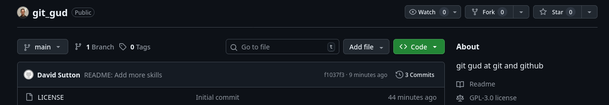

# Forking

Forking is used to make a copy of someone else's repository so that you can make changes and commits without the approval of the author. Many large open source projects use forking as a means to letting people make changes and suggestions without needing anymore than read permissions to the repository where the project lives. However, forking is not typically neccessary for a smaller or internal project where all contributors can have permissions to the codebase and commit directly.

# How to Fork

Forking is one of the few skills in this course that will make use of the mouse and a user interface.

1. In the top right of the repository page, there is a collection of actions to do with the repo. Press the fork button to fork to your account.

2. This will present you with options about how to fork the repo to your account, you can set a new name and description. Typically these can be left to their default values.

3. Once the repo has been forked it will show up under your repos, and when looking at the repo, it will indicate that the repo has been forked, and where the repo was forked from.
